# Pi Monorepo 架构文档

## 概览

Pi 是一套用于构建 AI Agent 和管理 LLM 部署的工具集，采用 pnpm workspace monorepo 结构，所有包统一版本号（lockstep versioning）。

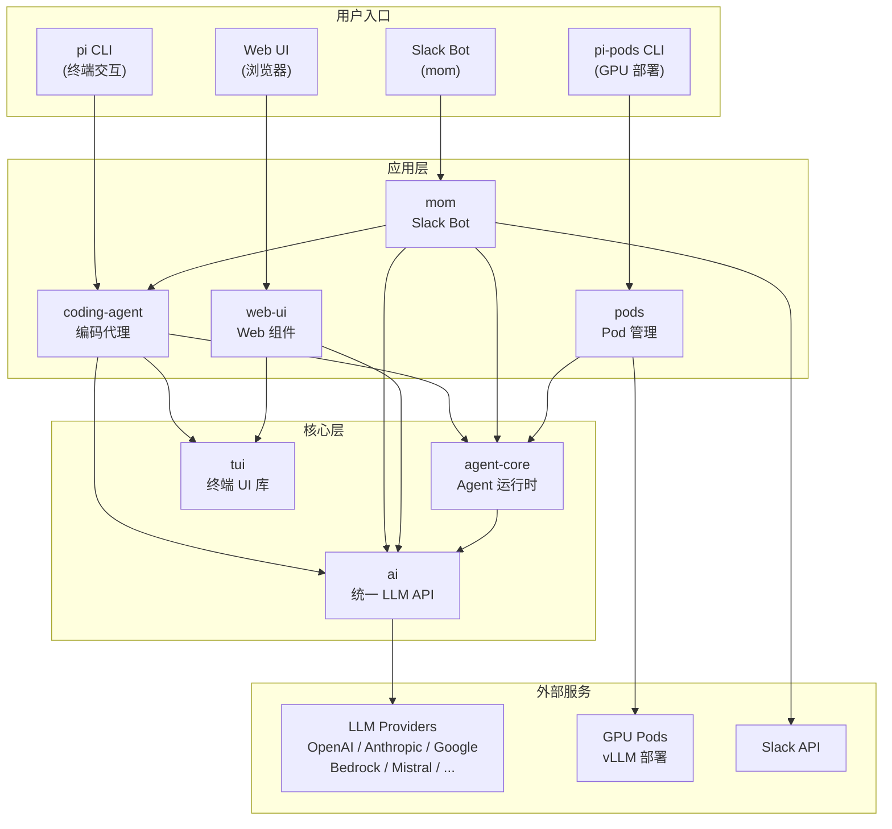

## 包依赖关系

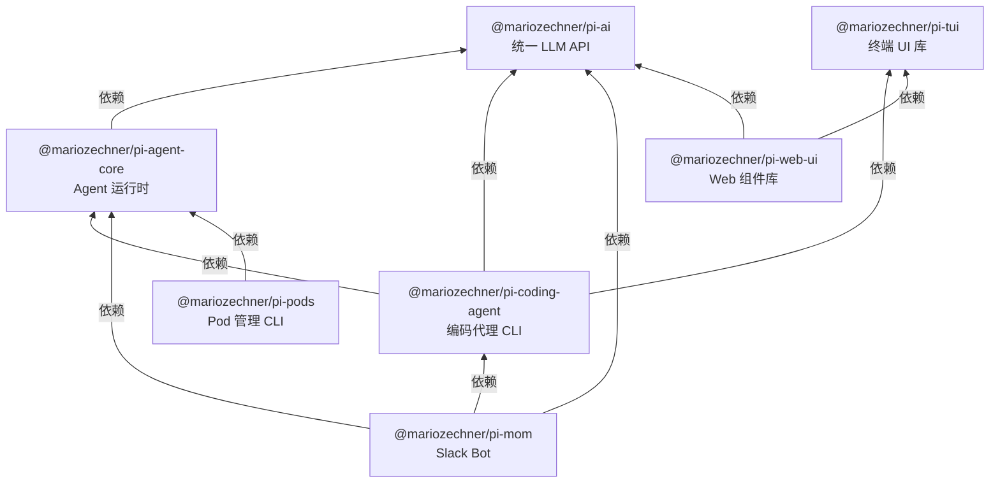

> `ai` 和 `tui` 是两个没有内部依赖的基础包，位于依赖树的最底层。

## 各包职责

### pi-ai -- 统一 LLM API

多 provider 的统一流式 LLM 接口。负责模型发现、消息转换、工具调用协议适配、token 计算与上下文管理。

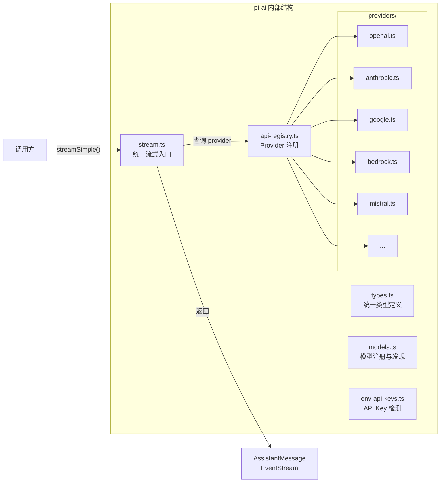

支持的 Provider: OpenAI, Anthropic, Google GenAI, AWS Bedrock, Mistral, OpenRouter, Groq, DeepSeek, xAI 等。

### pi-agent-core -- Agent 运行时

有状态的 Agent 运行时，提供消息管理、工具执行循环、上下文转换与事件系统。

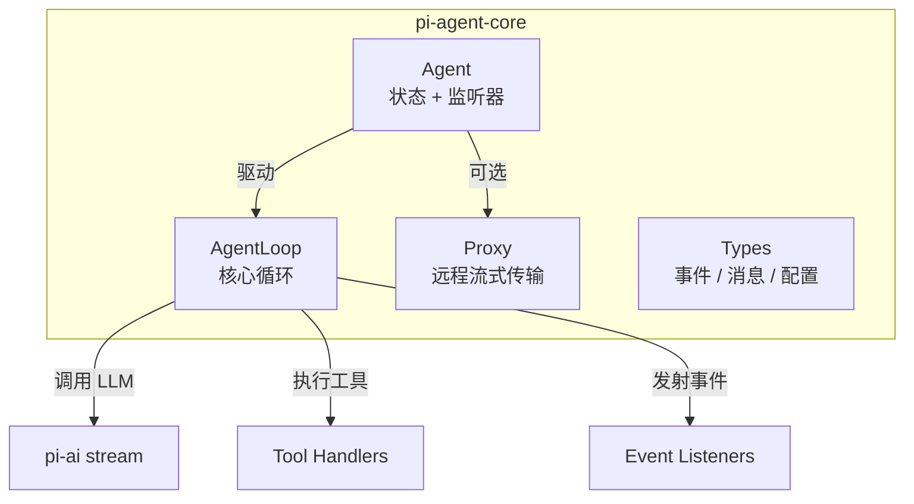

核心循环流程：

```mermaid
sequenceDiagram
    participant User as 调用方
    participant Agent as Agent
    participant Loop as AgentLoop
    participant LLM as pi-ai
    participant Tool as 工具

    User->>Agent: send(message)
    Agent->>Loop: 进入循环
    Loop->>LLM: streamSimple()
    LLM-->>Loop: text / tool_call 事件流
    alt 有工具调用
        Loop->>Tool: 执行工具
        Tool-->>Loop: 工具结果
        Loop->>LLM: 携带结果继续流式
    end
    Loop-->>Agent: 完成 / stop 事件
    Agent-->>User: 最终响应
```

### pi-coding-agent -- 编码代理 CLI

交互式终端编码代理，支持文件读写、代码编辑、Shell 执行、会话管理、扩展/技能系统。

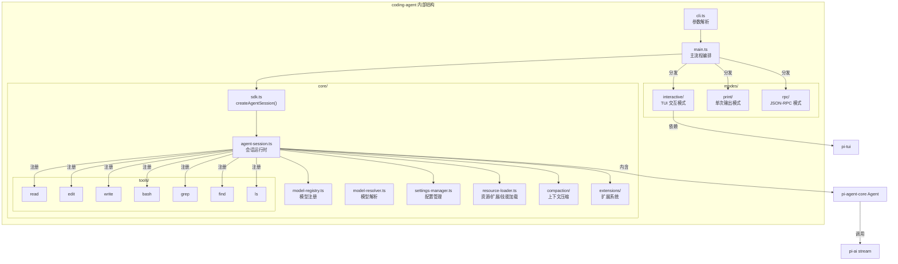

运行模式：

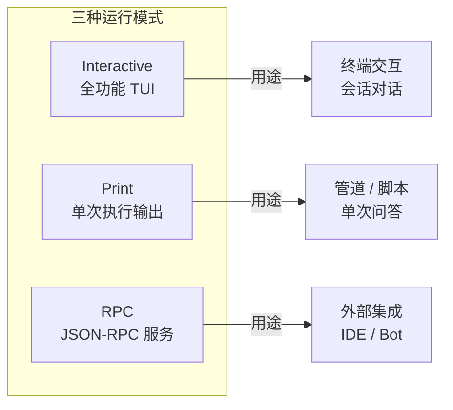

### pi-tui -- 终端 UI 库

基于差分渲染的终端 UI 库，提供无闪烁输出、组件化输入编辑体验。

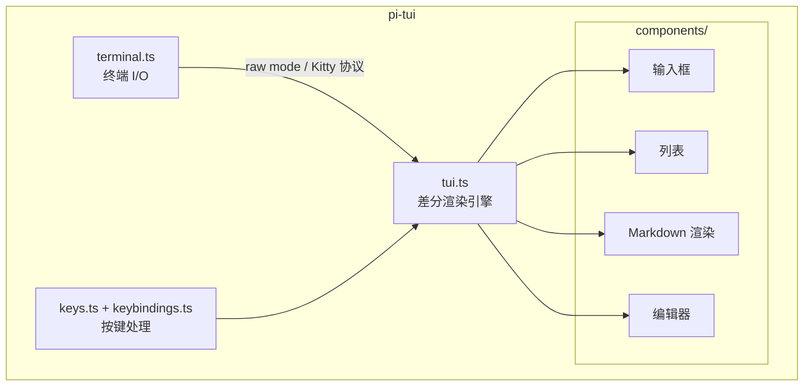

### pi-mom -- Slack Bot

Slack Bot 进程，将 Slack 消息委托给 pi-coding-agent 会话执行。

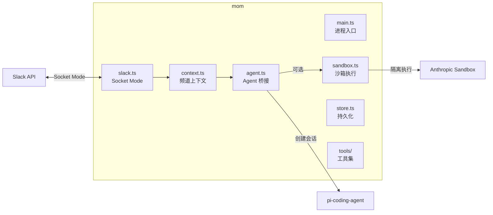

### pi-web-ui -- Web 组件库

基于 Web Components 的聊天 UI 组件库，为浏览器端 AI 交互提供开箱即用的界面。

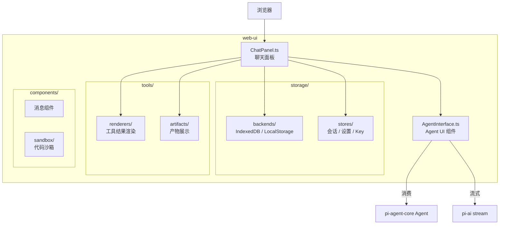

### pi-pods -- GPU Pod 管理 CLI

管理远程 GPU Pod 上 vLLM 部署的命令行工具。

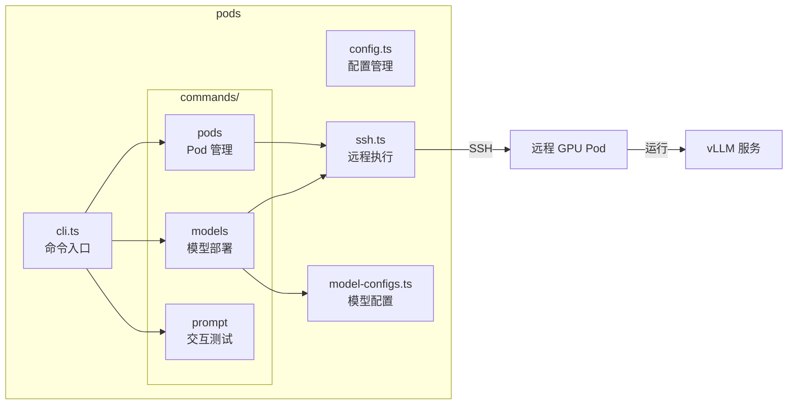

## 数据流总览

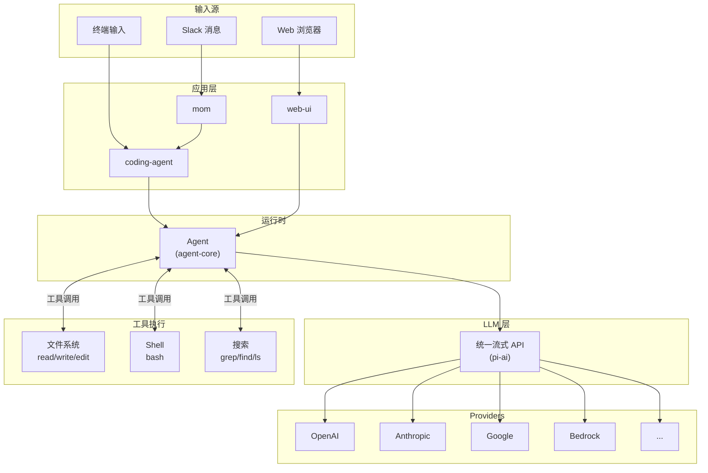

## 构建顺序

由于包间依赖关系，构建必须按以下顺序进行：

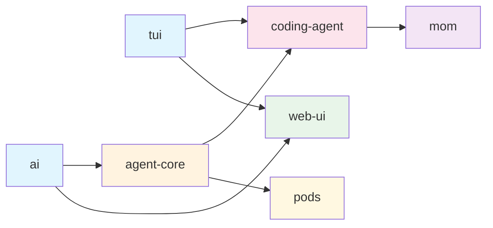

构建命令链：`tui` → `ai` → `agent-core` → `coding-agent` → `mom` / `web-ui` / `pods`

## 技术栈

```mermaid
mindmap
  root((Pi Monorepo))
    语言与工具链
      TypeScript
      pnpm workspace
      Biome (lint + format)
      tsgo (type check)
      Vitest (测试)
    核心运行时
      Node.js >= 20
      ESM 模块
    终端
      Kitty 图形协议
      差分渲染
      koffi (FFI)
    Web
      Lit / Web Components
      IndexedDB
    LLM Providers
      OpenAI
      Anthropic
      Google GenAI
      AWS Bedrock
      Mistral
      DeepSeek
      xAI
      Groq
      OpenRouter
    部署
      vLLM
      GPU Pods
      SSH
    集成
      Slack Socket Mode
      Anthropic Sandbox
